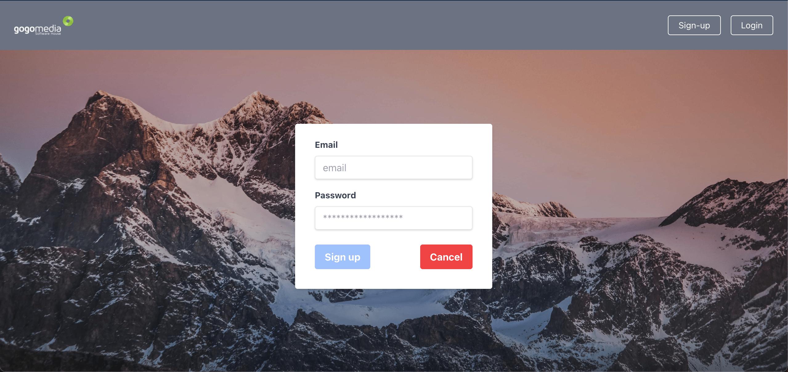
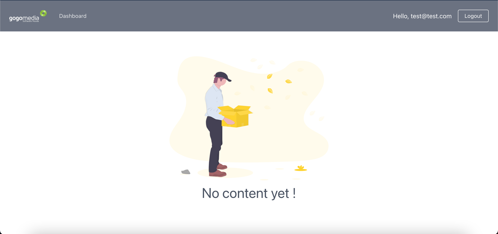

# Gogodashboard

This project was generated with [Angular CLI](https://github.com/angular/angular-cli) version 10.1.7.

## Technologies

- Angular 10
- NGRX 10
- Tailwind 2.0
- Firebase Authentication

## Goal

The goal of this project is to create a dummy dashboard accessible by authenticating a user. The state is managed by NGRX and holds the user logged in. After logging, the user informations are stored in the local storage. In addition, an interceptor was setup to pass the token to any requests. It is, however, not used here.

## Screenshots

The login page

The dashboard

